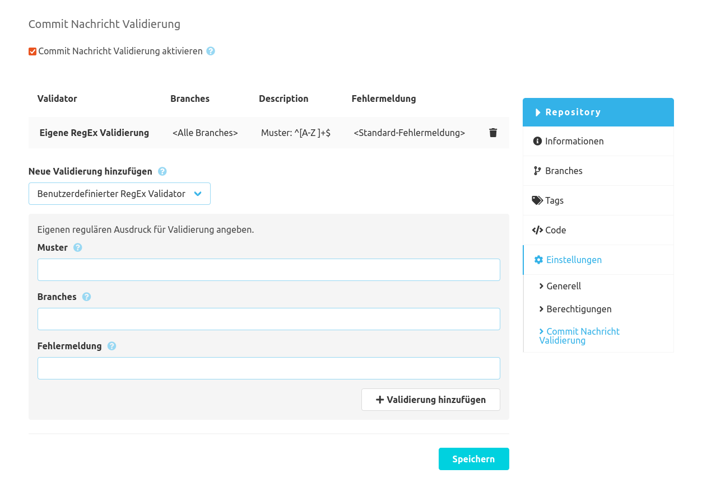

Wie im SCM-Manager 2 üblich, gibt es eine globale und eine repository-spezifische Konfiguration für das Commit-Message-Checker-Plugin. Die globale Konfiguration gilt für alle Repositories, die keine spezifische Konfiguration hinterlegt haben. Inhaltlich unterscheiden sich die Konfigurationen lediglich darin, dass in der globalen Konfiguration die repository-spezifische Konfiguration deaktiviert werden kann. 

### Konfigurationsformular
Um Ihre Commit-Nachrichten zu validieren, können Sie die verfügbaren konfigurierbaren Validatoren nutzen. 
Andere SCM-Manager Plugins können Ihre eigenen Validatoren liefern, die in dieser Konfiguration verwendet werden können.
Dieses Plugin liefert nur einen Validator, der mehrfach angewandt werden kann.

### Benutzerdefinierter RegEx Validator
Der `Benutzerdefinierte RegEx Validator` validiert Commit Nachrichten anhand des vorgegebenen regulären Ausdrucks.
Neben dem Muster können die Branches eingeschränkt werden und eine eigene Fehlermeldung, die bei ungültigen Commit-Nachrichten angezeigt wird, kann gesetzt werden.

Der Validator prüft, ob das Muster in einem beliebigen Teil der Nachricht vorkommt. Damit die gesamte Nachricht gegen
das Muster geprüft werden soll, muss das Muster mit `^` und `$` eingeschlossen werden wie z. B. `^[A-Za-z0-9 ]*$`.

Beispiele:

| Muster                  |Prüfung|
|-------------------------|---|
| `^[A-Za-z0-9 ]*$`       |Die gesamte Nachricht darf nur Buchstaben, Zahlen und Leerzeichen enthalten|
| `#[0-9]+`               |Die Nachricht muss eine Nummer mit einem führenden "Hash" Zeichen wie `#42` enthalten|
| `.{10}`                 |Die Nachricht muss mindestens 10 Zeichen lang sein|
| `fixed\|updated\|added` |Die Nachricht muss eines der Worte `fixed`, `updated` oder `added` enthalten|

