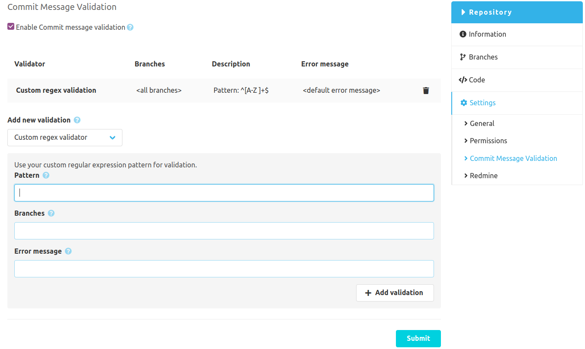

The SCM-Commit-Message-Checker-Plugin can be configured globally and repository specific. The global configuration is used for all repositories which doesn't have an specific config. The repository specific configuration can be disabled in the global config.

### Configuration form
To validate your commit messages you can use the provided configurable validators. Other SCM-Manager plugins may provide their own validators which can be used in this configuration.
This plugin only has one validator which can be applied multiple times.

### Custom RegEx Validator
The Custom Regular Express Validator can validate commit messages using your own regular expression. 
Besides the pattern you can also set which branches should be validated and what error message will be shown on invalid commit messages.

